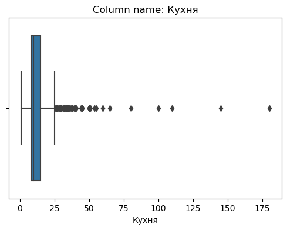
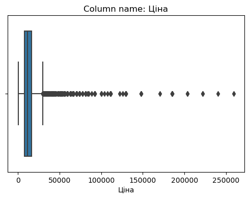

## Load libraries


```python
import pandas as pd
import requests
import os
import warnings
from selenium import webdriver
from webdriver_manager.chrome import ChromeDriverManager
from bs4 import BeautifulSoup
import time
import matplotlib.pyplot as plt
import seaborn as sns
import pandas as pd
import requests 
import os 
import warnings
warnings.simplefilter(action='ignore', category=FutureWarning)
from sklearn.model_selection import train_test_split, GridSearchCV, KFold
from sklearn.linear_model import LinearRegression
from sklearn.metrics import mean_squared_error, r2_score, mean_absolute_error
from sklearn.preprocessing import MinMaxScaler, LabelEncoder
import numpy as np
from scipy.stats import zscore
from sklearn.ensemble import RandomForestRegressor
import xgboost as xgb
import joblib
from lightgbm import LGBMRegressor
from catboost import CatBoostRegressor, cv
```

## Dataset Creation


```python
def create_directory(directory_path):
    # Проверяем, существует ли директория
    if not os.path.exists(directory_path):
        # Создаем директорию, если она не существует
        os.makedirs(directory_path)
        print(f"Директория {directory_path} успешно создана.")
    else:
        print(f"Директория {directory_path} уже существует.")

# Пример использования:
directory_path = "HousePrice_excels"
create_directory(directory_path)

```

    Директория HousePrice_excels уже существует.
    

### Download excel files


```python
def download_excel_selenim(download_directory, n_page, state_id):
    files_count = os.listdir(download_directory)
    # Set up ChromeOptions
    chrome_options = webdriver.ChromeOptions()

    # Set the download directory
    prefs = {
       "download.default_directory": download_directory,
       "savefile.default_directory": download_directory
    }
    chrome_options.add_experimental_option('prefs', prefs)
    #chrome_options.add_argument('--headless=new')

    # Instantiate the Chrome driver with the configured options
    driver = webdriver.Chrome(ChromeDriverManager().install(),
                              chrome_options=chrome_options
                             )
    driver.get(f'https://dom.ria.com/uk/search/xls/?excludeSold=1&category=1&realty_type=2&operation=3&state_id={state_id}&price_cur=1&wo_dupl=1&sort=inspected_sort&firstIteraction=false&client=searchV2&limit=20&page={n_page}&type=list&ch=246_244&xls=1')
    time.sleep(1.2)
    if os.listdir(download_directory) == files_count:
        input()
    else:
        pass
```


```python
for state_id in range(1, 25):
    for n_page in range(1, 30):
        download_excel_selenim(os.path.join(os.getcwd(), directory_path), state_id, n_page)

```

    C:\Users\MLZZZDS\AppData\Local\Temp\ipykernel_19048\2558725661.py:15: DeprecationWarning: executable_path has been deprecated, please pass in a Service object
      driver = webdriver.Chrome(ChromeDriverManager().install(),
    C:\Users\MLZZZDS\AppData\Local\Temp\ipykernel_19048\2558725661.py:15: DeprecationWarning: use options instead of chrome_options
      driver = webdriver.Chrome(ChromeDriverManager().install(),
    


    ---------------------------------------------------------------------------

    KeyboardInterrupt                         Traceback (most recent call last)

    Cell In[5], line 3
          1 for state_id in range(1, 25):
          2     for n_page in range(1, 30):
    ----> 3         download_excel_selenim(os.path.join(os.getcwd(), directory_path), state_id, n_page)
    

    Cell In[3], line 15, in download_excel_selenim(download_directory, n_page, state_id)
         11 chrome_options.add_experimental_option('prefs', prefs)
         12 #chrome_options.add_argument('--headless=new')
         13 
         14 # Instantiate the Chrome driver with the configured options
    ---> 15 driver = webdriver.Chrome(ChromeDriverManager().install(),
         16                           chrome_options=chrome_options
         17                          )
         18 driver.get(f'https://dom.ria.com/uk/search/xls/?excludeSold=1&category=1&realty_type=2&operation=3&state_id={state_id}&price_cur=1&wo_dupl=1&sort=inspected_sort&firstIteraction=false&client=searchV2&limit=20&page={n_page}&type=list&ch=246_244&xls=1')
         19 time.sleep(1.2)
    

    File ~\AppData\Roaming\Python\Python310\site-packages\webdriver_manager\chrome.py:40, in ChromeDriverManager.install(self)
         39 def install(self) -> str:
    ---> 40     driver_path = self._get_driver_binary_path(self.driver)
         41     os.chmod(driver_path, 0o755)
         42     return driver_path
    

    File ~\AppData\Roaming\Python\Python310\site-packages\webdriver_manager\core\manager.py:35, in DriverManager._get_driver_binary_path(self, driver)
         34 def _get_driver_binary_path(self, driver):
    ---> 35     binary_path = self._cache_manager.find_driver(driver)
         36     if binary_path:
         37         return binary_path
    

    File ~\AppData\Roaming\Python\Python310\site-packages\webdriver_manager\core\driver_cache.py:105, in DriverCacheManager.find_driver(self, driver)
        102 if not browser_version:
        103     return None
    --> 105 driver_version = self.get_cache_key_driver_version(driver)
        106 metadata = self.load_metadata_content()
        108 key = self.__get_metadata_key(driver)
    

    File ~\AppData\Roaming\Python\Python310\site-packages\webdriver_manager\core\driver_cache.py:152, in DriverCacheManager.get_cache_key_driver_version(self, driver)
        150 if self._cache_key_driver_version:
        151     return self._cache_key_driver_version
    --> 152 return driver.get_driver_version_to_download()
    

    File ~\AppData\Roaming\Python\Python310\site-packages\webdriver_manager\core\driver.py:48, in Driver.get_driver_version_to_download(self)
         45 if self._driver_version_to_download:
         46     return self._driver_version_to_download
    ---> 48 return self.get_latest_release_version()
    

    File ~\AppData\Roaming\Python\Python310\site-packages\webdriver_manager\drivers\chrome.py:59, in ChromeDriver.get_latest_release_version(self)
         57 if determined_browser_version is not None and version.parse(determined_browser_version) >= version.parse("115"):
         58     url = "https://googlechromelabs.github.io/chrome-for-testing/latest-patch-versions-per-build.json"
    ---> 59     response = self._http_client.get(url)
         60     response_dict = json.loads(response.text)
         61     determined_browser_version = response_dict.get("builds").get(determined_browser_version).get("version")
    

    File ~\AppData\Roaming\Python\Python310\site-packages\webdriver_manager\core\http.py:32, in WDMHttpClient.get(self, url, **kwargs)
         30 def get(self, url, **kwargs) -> Response:
         31     try:
    ---> 32         resp = requests.get(
         33             url=url, verify=self._ssl_verify, stream=True, **kwargs)
         34     except exceptions.ConnectionError:
         35         raise exceptions.ConnectionError(f"Could not reach host. Are you offline?")
    

    File C:\ProgramData\anaconda3\lib\site-packages\requests\api.py:73, in get(url, params, **kwargs)
         62 def get(url, params=None, **kwargs):
         63     r"""Sends a GET request.
         64 
         65     :param url: URL for the new :class:`Request` object.
       (...)
         70     :rtype: requests.Response
         71     """
    ---> 73     return request("get", url, params=params, **kwargs)
    

    File C:\ProgramData\anaconda3\lib\site-packages\requests\api.py:59, in request(method, url, **kwargs)
         55 # By using the 'with' statement we are sure the session is closed, thus we
         56 # avoid leaving sockets open which can trigger a ResourceWarning in some
         57 # cases, and look like a memory leak in others.
         58 with sessions.Session() as session:
    ---> 59     return session.request(method=method, url=url, **kwargs)
    

    File C:\ProgramData\anaconda3\lib\site-packages\requests\sessions.py:587, in Session.request(self, method, url, params, data, headers, cookies, files, auth, timeout, allow_redirects, proxies, hooks, stream, verify, cert, json)
        582 send_kwargs = {
        583     "timeout": timeout,
        584     "allow_redirects": allow_redirects,
        585 }
        586 send_kwargs.update(settings)
    --> 587 resp = self.send(prep, **send_kwargs)
        589 return resp
    

    File C:\ProgramData\anaconda3\lib\site-packages\requests\sessions.py:701, in Session.send(self, request, **kwargs)
        698 start = preferred_clock()
        700 # Send the request
    --> 701 r = adapter.send(request, **kwargs)
        703 # Total elapsed time of the request (approximately)
        704 elapsed = preferred_clock() - start
    

    File C:\ProgramData\anaconda3\lib\site-packages\requests\adapters.py:489, in HTTPAdapter.send(self, request, stream, timeout, verify, cert, proxies)
        487 try:
        488     if not chunked:
    --> 489         resp = conn.urlopen(
        490             method=request.method,
        491             url=url,
        492             body=request.body,
        493             headers=request.headers,
        494             redirect=False,
        495             assert_same_host=False,
        496             preload_content=False,
        497             decode_content=False,
        498             retries=self.max_retries,
        499             timeout=timeout,
        500         )
        502     # Send the request.
        503     else:
        504         if hasattr(conn, "proxy_pool"):
    

    File C:\ProgramData\anaconda3\lib\site-packages\urllib3\connectionpool.py:703, in HTTPConnectionPool.urlopen(self, method, url, body, headers, retries, redirect, assert_same_host, timeout, pool_timeout, release_conn, chunked, body_pos, **response_kw)
        700     self._prepare_proxy(conn)
        702 # Make the request on the httplib connection object.
    --> 703 httplib_response = self._make_request(
        704     conn,
        705     method,
        706     url,
        707     timeout=timeout_obj,
        708     body=body,
        709     headers=headers,
        710     chunked=chunked,
        711 )
        713 # If we're going to release the connection in ``finally:``, then
        714 # the response doesn't need to know about the connection. Otherwise
        715 # it will also try to release it and we'll have a double-release
        716 # mess.
        717 response_conn = conn if not release_conn else None
    

    File C:\ProgramData\anaconda3\lib\site-packages\urllib3\connectionpool.py:386, in HTTPConnectionPool._make_request(self, conn, method, url, timeout, chunked, **httplib_request_kw)
        384 # Trigger any extra validation we need to do.
        385 try:
    --> 386     self._validate_conn(conn)
        387 except (SocketTimeout, BaseSSLError) as e:
        388     # Py2 raises this as a BaseSSLError, Py3 raises it as socket timeout.
        389     self._raise_timeout(err=e, url=url, timeout_value=conn.timeout)
    

    File C:\ProgramData\anaconda3\lib\site-packages\urllib3\connectionpool.py:1042, in HTTPSConnectionPool._validate_conn(self, conn)
       1040 # Force connect early to allow us to validate the connection.
       1041 if not getattr(conn, "sock", None):  # AppEngine might not have  `.sock`
    -> 1042     conn.connect()
       1044 if not conn.is_verified:
       1045     warnings.warn(
       1046         (
       1047             "Unverified HTTPS request is being made to host '%s'. "
       (...)
       1052         InsecureRequestWarning,
       1053     )
    

    File C:\ProgramData\anaconda3\lib\site-packages\urllib3\connection.py:358, in HTTPSConnection.connect(self)
        356 def connect(self):
        357     # Add certificate verification
    --> 358     self.sock = conn = self._new_conn()
        359     hostname = self.host
        360     tls_in_tls = False
    

    File C:\ProgramData\anaconda3\lib\site-packages\urllib3\connection.py:174, in HTTPConnection._new_conn(self)
        171     extra_kw["socket_options"] = self.socket_options
        173 try:
    --> 174     conn = connection.create_connection(
        175         (self._dns_host, self.port), self.timeout, **extra_kw
        176     )
        178 except SocketTimeout:
        179     raise ConnectTimeoutError(
        180         self,
        181         "Connection to %s timed out. (connect timeout=%s)"
        182         % (self.host, self.timeout),
        183     )
    

    File C:\ProgramData\anaconda3\lib\site-packages\urllib3\util\connection.py:85, in create_connection(address, timeout, source_address, socket_options)
         83     if source_address:
         84         sock.bind(source_address)
    ---> 85     sock.connect(sa)
         86     return sock
         88 except socket.error as e:
    

    KeyboardInterrupt: 


```python
for state_id in range(21, 25):
    for n_page in range(1, 30):
        download_excel_selenim(os.path.join(os.getcwd(), directory_path), state_id, n_page)

```

### Combine excel files to a DataFrame


```python
combined_df = pd.DataFrame()

for filename in os.listdir(directory_path):
    file_path = os.path.join(directory_path, filename)
    try:
        df = pd.read_excel(file_path)
        combined_df = pd.concat([combined_df, df], ignore_index=True)
    except Exception as e:
        print(f"An error occurred while reading a file {file_path}: {e}")
```

    WARNING *** OLE2 inconsistency: SSCS size is 0 but SSAT size is non-zero
    WARNING *** OLE2 inconsistency: SSCS size is 0 but SSAT size is non-zero
    WARNING *** OLE2 inconsistency: SSCS size is 0 but SSAT size is non-zero
    WARNING *** OLE2 inconsistency: SSCS size is 0 but SSAT size is non-zero
    WARNING *** OLE2 inconsistency: SSCS size is 0 but SSAT size is non-zero
    WARNING *** OLE2 inconsistency: SSCS size is 0 but SSAT size is non-zero
    WARNING *** OLE2 inconsistency: SSCS size is 0 but SSAT size is non-zero
    WARNING *** OLE2 inconsistency: SSCS size is 0 but SSAT size is non-zero
    WARNING *** OLE2 inconsistency: SSCS size is 0 but SSAT size is non-zero
    WARNING *** OLE2 inconsistency: SSCS size is 0 but SSAT size is non-zero
    WARNING *** OLE2 inconsistency: SSCS size is 0 but SSAT size is non-zero
    WARNING *** OLE2 inconsistency: SSCS size is 0 but SSAT size is non-zero
    WARNING *** OLE2 inconsistency: SSCS size is 0 but SSAT size is non-zero
    WARNING *** OLE2 inconsistency: SSCS size is 0 but SSAT size is non-zero
    An error occurred while reading a file HousePrice_excels\DOM.RIA.com_page_1 (24).xls: unpack requires a buffer of 2 bytes
    WARNING *** OLE2 inconsistency: SSCS size is 0 but SSAT size is non-zero
    An error occurred while reading a file HousePrice_excels\DOM.RIA.com_page_1 (29).xls: list index out of range
    WARNING *** OLE2 inconsistency: SSCS size is 0 but SSAT size is non-zero
    WARNING *** OLE2 inconsistency: SSCS size is 0 but SSAT size is non-zero
    WARNING *** OLE2 inconsistency: SSCS size is 0 but SSAT size is non-zero
    WARNING *** OLE2 inconsistency: SSCS size is 0 but SSAT size is non-zero
    An error occurred while reading a file HousePrice_excels\DOM.RIA.com_page_1 (32).xls: list index out of range
    WARNING *** OLE2 inconsistency: SSCS size is 0 but SSAT size is non-zero
    WARNING *** OLE2 inconsistency: SSCS size is 0 but SSAT size is non-zero
    WARNING *** OLE2 inconsistency: SSCS size is 0 but SSAT size is non-zero
    WARNING *** OLE2 inconsistency: SSCS size is 0 but SSAT size is non-zero
    WARNING *** OLE2 inconsistency: SSCS size is 0 but SSAT size is non-zero
    WARNING *** OLE2 inconsistency: SSCS size is 0 but SSAT size is non-zero
    WARNING *** OLE2 inconsistency: SSCS size is 0 but SSAT size is non-zero
    WARNING *** OLE2 inconsistency: SSCS size is 0 but SSAT size is non-zero
    WARNING *** OLE2 inconsistency: SSCS size is 0 but SSAT size is non-zero
    WARNING *** OLE2 inconsistency: SSCS size is 0 but SSAT size is non-zero
    WARNING *** OLE2 inconsistency: SSCS size is 0 but SSAT size is non-zero
    WARNING *** OLE2 inconsistency: SSCS size is 0 but SSAT size is non-zero
    WARNING *** OLE2 inconsistency: SSCS size is 0 but SSAT size is non-zero
    An error occurred while reading a file HousePrice_excels\DOM.RIA.com_page_1 (46).xls: 'utf-16-le' codec can't decode bytes in position 908-909: illegal UTF-16 surrogate
    WARNING *** OLE2 inconsistency: SSCS size is 0 but SSAT size is non-zero
    WARNING *** OLE2 inconsistency: SSCS size is 0 but SSAT size is non-zero
    WARNING *** OLE2 inconsistency: SSCS size is 0 but SSAT size is non-zero
    WARNING *** OLE2 inconsistency: SSCS size is 0 but SSAT size is non-zero
    WARNING *** OLE2 inconsistency: SSCS size is 0 but SSAT size is non-zero
    WARNING *** OLE2 inconsistency: SSCS size is 0 but SSAT size is non-zero
    WARNING *** OLE2 inconsistency: SSCS size is 0 but SSAT size is non-zero
    An error occurred while reading a file HousePrice_excels\DOM.RIA.com_page_1 (53).xls: unpack requires a buffer of 4 bytes
    WARNING *** OLE2 inconsistency: SSCS size is 0 but SSAT size is non-zero
    An error occurred while reading a file HousePrice_excels\DOM.RIA.com_page_1 (58).xls: list index out of range
    WARNING *** OLE2 inconsistency: SSCS size is 0 but SSAT size is non-zero
    WARNING *** OLE2 inconsistency: SSCS size is 0 but SSAT size is non-zero
    WARNING *** OLE2 inconsistency: SSCS size is 0 but SSAT size is non-zero
    WARNING *** OLE2 inconsistency: SSCS size is 0 but SSAT size is non-zero
    WARNING *** OLE2 inconsistency: SSCS size is 0 but SSAT size is non-zero
    WARNING *** OLE2 inconsistency: SSCS size is 0 but SSAT size is non-zero
    WARNING *** OLE2 inconsistency: SSCS size is 0 but SSAT size is non-zero
    WARNING *** OLE2 inconsistency: SSCS size is 0 but SSAT size is non-zero
    WARNING *** OLE2 inconsistency: SSCS size is 0 but SSAT size is non-zero
    WARNING *** OLE2 inconsistency: SSCS size is 0 but SSAT size is non-zero
    WARNING *** OLE2 inconsistency: SSCS size is 0 but SSAT size is non-zero
    WARNING *** OLE2 inconsistency: SSCS size is 0 but SSAT size is non-zero
    WARNING *** OLE2 inconsistency: SSCS size is 0 but SSAT size is non-zero
    WARNING *** OLE2 inconsistency: SSCS size is 0 but SSAT size is non-zero
    WARNING *** OLE2 inconsistency: SSCS size is 0 but SSAT size is non-zero
    An error occurred while reading a file HousePrice_excels\DOM.RIA.com_page_10 (24).xls: list index out of range
    WARNING *** OLE2 inconsistency: SSCS size is 0 but SSAT size is non-zero
    WARNING *** OLE2 inconsistency: SSCS size is 0 but SSAT size is non-zero
    An error occurred while reading a file HousePrice_excels\DOM.RIA.com_page_10 (4).xls: list index out of range
    WARNING *** OLE2 inconsistency: SSCS size is 0 but SSAT size is non-zero
    WARNING *** OLE2 inconsistency: SSCS size is 0 but SSAT size is non-zero
    WARNING *** OLE2 inconsistency: SSCS size is 0 but SSAT size is non-zero
    WARNING *** OLE2 inconsistency: SSCS size is 0 but SSAT size is non-zero
    WARNING *** OLE2 inconsistency: SSCS size is 0 but SSAT size is non-zero
    WARNING *** OLE2 inconsistency: SSCS size is 0 but SSAT size is non-zero
    WARNING *** OLE2 inconsistency: SSCS size is 0 but SSAT size is non-zero
    WARNING *** OLE2 inconsistency: SSCS size is 0 but SSAT size is non-zero
    WARNING *** OLE2 inconsistency: SSCS size is 0 but SSAT size is non-zero
    WARNING *** OLE2 inconsistency: SSCS size is 0 but SSAT size is non-zero
    WARNING *** OLE2 inconsistency: SSCS size is 0 but SSAT size is non-zero
    WARNING *** OLE2 inconsistency: SSCS size is 0 but SSAT size is non-zero
    An error occurred while reading a file HousePrice_excels\DOM.RIA.com_page_11 (24).xls: unpack requires a buffer of 4 bytes
    WARNING *** OLE2 inconsistency: SSCS size is 0 but SSAT size is non-zero
    WARNING *** OLE2 inconsistency: SSCS size is 0 but SSAT size is non-zero
    WARNING *** OLE2 inconsistency: SSCS size is 0 but SSAT size is non-zero
    WARNING *** OLE2 inconsistency: SSCS size is 0 but SSAT size is non-zero
    WARNING *** OLE2 inconsistency: SSCS size is 0 but SSAT size is non-zero
    WARNING *** OLE2 inconsistency: SSCS size is 0 but SSAT size is non-zero
    WARNING *** OLE2 inconsistency: SSCS size is 0 but SSAT size is non-zero
    WARNING *** OLE2 inconsistency: SSCS size is 0 but SSAT size is non-zero
    WARNING *** OLE2 inconsistency: SSCS size is 0 but SSAT size is non-zero
    WARNING *** OLE2 inconsistency: SSCS size is 0 but SSAT size is non-zero
    WARNING *** OLE2 inconsistency: SSCS size is 0 but SSAT size is non-zero
    WARNING *** OLE2 inconsistency: SSCS size is 0 but SSAT size is non-zero
    An error occurred while reading a file HousePrice_excels\DOM.RIA.com_page_12 (2).xls: unpack requires a buffer of 2 bytes
    WARNING *** OLE2 inconsistency: SSCS size is 0 but SSAT size is non-zero
    WARNING *** OLE2 inconsistency: SSCS size is 0 but SSAT size is non-zero
    An error occurred while reading a file HousePrice_excels\DOM.RIA.com_page_12 (24).xls: list index out of range
    WARNING *** OLE2 inconsistency: SSCS size is 0 but SSAT size is non-zero
    WARNING *** OLE2 inconsistency: SSCS size is 0 but SSAT size is non-zero
    WARNING *** OLE2 inconsistency: SSCS size is 0 but SSAT size is non-zero
    WARNING *** OLE2 inconsistency: SSCS size is 0 but SSAT size is non-zero
    WARNING *** OLE2 inconsistency: SSCS size is 0 but SSAT size is non-zero
    WARNING *** OLE2 inconsistency: SSCS size is 0 but SSAT size is non-zero
    WARNING *** OLE2 inconsistency: SSCS size is 0 but SSAT size is non-zero
    WARNING *** OLE2 inconsistency: SSCS size is 0 but SSAT size is non-zero
    WARNING *** OLE2 inconsistency: SSCS size is 0 but SSAT size is non-zero
    WARNING *** OLE2 inconsistency: SSCS size is 0 but SSAT size is non-zero
    WARNING *** OLE2 inconsistency: SSCS size is 0 but SSAT size is non-zero
    WARNING *** OLE2 inconsistency: SSCS size is 0 but SSAT size is non-zero
    WARNING *** OLE2 inconsistency: SSCS size is 0 but SSAT size is non-zero
    WARNING *** OLE2 inconsistency: SSCS size is 0 but SSAT size is non-zero
    WARNING *** OLE2 inconsistency: SSCS size is 0 but SSAT size is non-zero
    WARNING *** OLE2 inconsistency: SSCS size is 0 but SSAT size is non-zero
    WARNING *** OLE2 inconsistency: SSCS size is 0 but SSAT size is non-zero
    An error occurred while reading a file HousePrice_excels\DOM.RIA.com_page_13.xls: 
    WARNING *** OLE2 inconsistency: SSCS size is 0 but SSAT size is non-zero
    WARNING *** OLE2 inconsistency: SSCS size is 0 but SSAT size is non-zero
    WARNING *** OLE2 inconsistency: SSCS size is 0 but SSAT size is non-zero
    WARNING *** OLE2 inconsistency: SSCS size is 0 but SSAT size is non-zero
    WARNING *** OLE2 inconsistency: SSCS size is 0 but SSAT size is non-zero
    An error occurred while reading a file HousePrice_excels\DOM.RIA.com_page_14 (2).xls: 
    WARNING *** OLE2 inconsistency: SSCS size is 0 but SSAT size is non-zero
    WARNING *** OLE2 inconsistency: SSCS size is 0 but SSAT size is non-zero
    WARNING *** OLE2 inconsistency: SSCS size is 0 but SSAT size is non-zero
    An error occurred while reading a file HousePrice_excels\DOM.RIA.com_page_14 (4).xls: unpack requires a buffer of 4 bytes
    WARNING *** OLE2 inconsistency: SSCS size is 0 but SSAT size is non-zero
    WARNING *** OLE2 inconsistency: SSCS size is 0 but SSAT size is non-zero
    WARNING *** OLE2 inconsistency: SSCS size is 0 but SSAT size is non-zero
    WARNING *** OLE2 inconsistency: SSCS size is 0 but SSAT size is non-zero
    WARNING *** OLE2 inconsistency: SSCS size is 0 but SSAT size is non-zero
    WARNING *** OLE2 inconsistency: SSCS size is 0 but SSAT size is non-zero
    WARNING *** OLE2 inconsistency: SSCS size is 0 but SSAT size is non-zero
    WARNING *** OLE2 inconsistency: SSCS size is 0 but SSAT size is non-zero
    WARNING *** OLE2 inconsistency: SSCS size is 0 but SSAT size is non-zero
    WARNING *** OLE2 inconsistency: SSCS size is 0 but SSAT size is non-zero
    An error occurred while reading a file HousePrice_excels\DOM.RIA.com_page_15 (4).xls: unpack requires a buffer of 2 bytes
    WARNING *** OLE2 inconsistency: SSCS size is 0 but SSAT size is non-zero
    WARNING *** OLE2 inconsistency: SSCS size is 0 but SSAT size is non-zero
    WARNING *** OLE2 inconsistency: SSCS size is 0 but SSAT size is non-zero
    WARNING *** OLE2 inconsistency: SSCS size is 0 but SSAT size is non-zero
    WARNING *** OLE2 inconsistency: SSCS size is 0 but SSAT size is non-zero
    WARNING *** OLE2 inconsistency: SSCS size is 0 but SSAT size is non-zero
    WARNING *** OLE2 inconsistency: SSCS size is 0 but SSAT size is non-zero
    WARNING *** OLE2 inconsistency: SSCS size is 0 but SSAT size is non-zero
    An error occurred while reading a file HousePrice_excels\DOM.RIA.com_page_16 (2).xls: 
    WARNING *** OLE2 inconsistency: SSCS size is 0 but SSAT size is non-zero
    WARNING *** OLE2 inconsistency: SSCS size is 0 but SSAT size is non-zero
    An error occurred while reading a file HousePrice_excels\DOM.RIA.com_page_16 (4).xls: unpack requires a buffer of 4 bytes
    WARNING *** OLE2 inconsistency: SSCS size is 0 but SSAT size is non-zero
    WARNING *** OLE2 inconsistency: SSCS size is 0 but SSAT size is non-zero
    WARNING *** OLE2 inconsistency: SSCS size is 0 but SSAT size is non-zero
    WARNING *** OLE2 inconsistency: SSCS size is 0 but SSAT size is non-zero
    WARNING *** OLE2 inconsistency: SSCS size is 0 but SSAT size is non-zero
    An error occurred while reading a file HousePrice_excels\DOM.RIA.com_page_17 (11).xls: unpack requires a buffer of 4 bytes
    WARNING *** OLE2 inconsistency: SSCS size is 0 but SSAT size is non-zero
    WARNING *** OLE2 inconsistency: SSCS size is 0 but SSAT size is non-zero
    WARNING *** OLE2 inconsistency: SSCS size is 0 but SSAT size is non-zero
    An error occurred while reading a file HousePrice_excels\DOM.RIA.com_page_17 (2).xls: unpack requires a buffer of 2 bytes
    WARNING *** OLE2 inconsistency: SSCS size is 0 but SSAT size is non-zero
    WARNING *** OLE2 inconsistency: SSCS size is 0 but SSAT size is non-zero
    WARNING *** OLE2 inconsistency: SSCS size is 0 but SSAT size is non-zero
    WARNING *** OLE2 inconsistency: SSCS size is 0 but SSAT size is non-zero
    WARNING *** OLE2 inconsistency: SSCS size is 0 but SSAT size is non-zero
    An error occurred while reading a file HousePrice_excels\DOM.RIA.com_page_17.xls: list index out of range
    WARNING *** OLE2 inconsistency: SSCS size is 0 but SSAT size is non-zero
    WARNING *** OLE2 inconsistency: SSCS size is 0 but SSAT size is non-zero
    An error occurred while reading a file HousePrice_excels\DOM.RIA.com_page_18 (11).xls: 
    WARNING *** OLE2 inconsistency: SSCS size is 0 but SSAT size is non-zero
    WARNING *** OLE2 inconsistency: SSCS size is 0 but SSAT size is non-zero
    An error occurred while reading a file HousePrice_excels\DOM.RIA.com_page_18 (2).xls: 
    WARNING *** OLE2 inconsistency: SSCS size is 0 but SSAT size is non-zero
    WARNING *** OLE2 inconsistency: SSCS size is 0 but SSAT size is non-zero
    An error occurred while reading a file HousePrice_excels\DOM.RIA.com_page_18 (4).xls: 
    WARNING *** OLE2 inconsistency: SSCS size is 0 but SSAT size is non-zero
    WARNING *** OLE2 inconsistency: SSCS size is 0 but SSAT size is non-zero
    WARNING *** OLE2 inconsistency: SSCS size is 0 but SSAT size is non-zero
    WARNING *** OLE2 inconsistency: SSCS size is 0 but SSAT size is non-zero
    WARNING *** OLE2 inconsistency: SSCS size is 0 but SSAT size is non-zero
    WARNING *** OLE2 inconsistency: SSCS size is 0 but SSAT size is non-zero
    WARNING *** OLE2 inconsistency: SSCS size is 0 but SSAT size is non-zero
    WARNING *** OLE2 inconsistency: SSCS size is 0 but SSAT size is non-zero
    WARNING *** OLE2 inconsistency: SSCS size is 0 but SSAT size is non-zero
    WARNING *** OLE2 inconsistency: SSCS size is 0 but SSAT size is non-zero
    WARNING *** OLE2 inconsistency: SSCS size is 0 but SSAT size is non-zero
    WARNING *** OLE2 inconsistency: SSCS size is 0 but SSAT size is non-zero
    WARNING *** OLE2 inconsistency: SSCS size is 0 but SSAT size is non-zero
    WARNING *** OLE2 inconsistency: SSCS size is 0 but SSAT size is non-zero
    WARNING *** OLE2 inconsistency: SSCS size is 0 but SSAT size is non-zero
    WARNING *** OLE2 inconsistency: SSCS size is 0 but SSAT size is non-zero
    WARNING *** OLE2 inconsistency: SSCS size is 0 but SSAT size is non-zero
    WARNING *** OLE2 inconsistency: SSCS size is 0 but SSAT size is non-zero
    An error occurred while reading a file HousePrice_excels\DOM.RIA.com_page_2 (17).xls: unpack requires a buffer of 4 bytes
    WARNING *** OLE2 inconsistency: SSCS size is 0 but SSAT size is non-zero
    WARNING *** OLE2 inconsistency: SSCS size is 0 but SSAT size is non-zero
    WARNING *** OLE2 inconsistency: SSCS size is 0 but SSAT size is non-zero
    WARNING *** OLE2 inconsistency: SSCS size is 0 but SSAT size is non-zero
    WARNING *** OLE2 inconsistency: SSCS size is 0 but SSAT size is non-zero
    An error occurred while reading a file HousePrice_excels\DOM.RIA.com_page_2 (23).xls: list index out of range
    WARNING *** OLE2 inconsistency: SSCS size is 0 but SSAT size is non-zero
    An error occurred while reading a file HousePrice_excels\DOM.RIA.com_page_2 (24).xls: unpack requires a buffer of 2 bytes
    WARNING *** OLE2 inconsistency: SSCS size is 0 but SSAT size is non-zero
    WARNING *** OLE2 inconsistency: SSCS size is 0 but SSAT size is non-zero
    WARNING *** OLE2 inconsistency: SSCS size is 0 but SSAT size is non-zero
    WARNING *** OLE2 inconsistency: SSCS size is 0 but SSAT size is non-zero
    WARNING *** OLE2 inconsistency: SSCS size is 0 but SSAT size is non-zero
    An error occurred while reading a file HousePrice_excels\DOM.RIA.com_page_2 (32).xls: unpack requires a buffer of 4 bytes
    WARNING *** OLE2 inconsistency: SSCS size is 0 but SSAT size is non-zero
    An error occurred while reading a file HousePrice_excels\DOM.RIA.com_page_2 (33).xls: unpack requires a buffer of 2 bytes
    WARNING *** OLE2 inconsistency: SSCS size is 0 but SSAT size is non-zero
    WARNING *** OLE2 inconsistency: SSCS size is 0 but SSAT size is non-zero
    WARNING *** OLE2 inconsistency: SSCS size is 0 but SSAT size is non-zero
    WARNING *** OLE2 inconsistency: SSCS size is 0 but SSAT size is non-zero
    WARNING *** OLE2 inconsistency: SSCS size is 0 but SSAT size is non-zero
    WARNING *** OLE2 inconsistency: SSCS size is 0 but SSAT size is non-zero
    WARNING *** OLE2 inconsistency: SSCS size is 0 but SSAT size is non-zero
    WARNING *** OLE2 inconsistency: SSCS size is 0 but SSAT size is non-zero
    WARNING *** OLE2 inconsistency: SSCS size is 0 but SSAT size is non-zero
    WARNING *** OLE2 inconsistency: SSCS size is 0 but SSAT size is non-zero
    WARNING *** OLE2 inconsistency: SSCS size is 0 but SSAT size is non-zero
    WARNING *** OLE2 inconsistency: SSCS size is 0 but SSAT size is non-zero
    WARNING *** OLE2 inconsistency: SSCS size is 0 but SSAT size is non-zero
    WARNING *** OLE2 inconsistency: SSCS size is 0 but SSAT size is non-zero
    WARNING *** OLE2 inconsistency: SSCS size is 0 but SSAT size is non-zero
    WARNING *** OLE2 inconsistency: SSCS size is 0 but SSAT size is non-zero
    WARNING *** OLE2 inconsistency: SSCS size is 0 but SSAT size is non-zero
    WARNING *** OLE2 inconsistency: SSCS size is 0 but SSAT size is non-zero
    WARNING *** OLE2 inconsistency: SSCS size is 0 but SSAT size is non-zero
    WARNING *** OLE2 inconsistency: SSCS size is 0 but SSAT size is non-zero
    WARNING *** OLE2 inconsistency: SSCS size is 0 but SSAT size is non-zero
    An error occurred while reading a file HousePrice_excels\DOM.RIA.com_page_20 (4).xls: unpack requires a buffer of 4 bytes
    WARNING *** OLE2 inconsistency: SSCS size is 0 but SSAT size is non-zero
    WARNING *** OLE2 inconsistency: SSCS size is 0 but SSAT size is non-zero
    WARNING *** OLE2 inconsistency: SSCS size is 0 but SSAT size is non-zero
    An error occurred while reading a file HousePrice_excels\DOM.RIA.com_page_20.xls: unpack requires a buffer of 4 bytes
    WARNING *** OLE2 inconsistency: SSCS size is 0 but SSAT size is non-zero
    WARNING *** OLE2 inconsistency: SSCS size is 0 but SSAT size is non-zero
    WARNING *** OLE2 inconsistency: SSCS size is 0 but SSAT size is non-zero
    WARNING *** OLE2 inconsistency: SSCS size is 0 but SSAT size is non-zero
    WARNING *** OLE2 inconsistency: SSCS size is 0 but SSAT size is non-zero
    WARNING *** OLE2 inconsistency: SSCS size is 0 but SSAT size is non-zero
    WARNING *** OLE2 inconsistency: SSCS size is 0 but SSAT size is non-zero
    WARNING *** OLE2 inconsistency: SSCS size is 0 but SSAT size is non-zero
    WARNING *** OLE2 inconsistency: SSCS size is 0 but SSAT size is non-zero
    WARNING *** OLE2 inconsistency: SSCS size is 0 but SSAT size is non-zero
    WARNING *** OLE2 inconsistency: SSCS size is 0 but SSAT size is non-zero
    WARNING *** OLE2 inconsistency: SSCS size is 0 but SSAT size is non-zero
    WARNING *** OLE2 inconsistency: SSCS size is 0 but SSAT size is non-zero
    WARNING *** OLE2 inconsistency: SSCS size is 0 but SSAT size is non-zero
    WARNING *** OLE2 inconsistency: SSCS size is 0 but SSAT size is non-zero
    WARNING *** OLE2 inconsistency: SSCS size is 0 but SSAT size is non-zero
    WARNING *** OLE2 inconsistency: SSCS size is 0 but SSAT size is non-zero
    An error occurred while reading a file HousePrice_excels\DOM.RIA.com_page_22 (9).xls: unpack requires a buffer of 2 bytes
    WARNING *** OLE2 inconsistency: SSCS size is 0 but SSAT size is non-zero
    WARNING *** OLE2 inconsistency: SSCS size is 0 but SSAT size is non-zero
    WARNING *** OLE2 inconsistency: SSCS size is 0 but SSAT size is non-zero
    An error occurred while reading a file HousePrice_excels\DOM.RIA.com_page_23 (11).xls: unpack requires a buffer of 4 bytes
    WARNING *** OLE2 inconsistency: SSCS size is 0 but SSAT size is non-zero
    WARNING *** OLE2 inconsistency: SSCS size is 0 but SSAT size is non-zero
    An error occurred while reading a file HousePrice_excels\DOM.RIA.com_page_23 (2).xls: unpack requires a buffer of 4 bytes
    WARNING *** OLE2 inconsistency: SSCS size is 0 but SSAT size is non-zero
    WARNING *** OLE2 inconsistency: SSCS size is 0 but SSAT size is non-zero
    An error occurred while reading a file HousePrice_excels\DOM.RIA.com_page_23 (4).xls: unpack requires a buffer of 4 bytes
    WARNING *** OLE2 inconsistency: SSCS size is 0 but SSAT size is non-zero
    WARNING *** OLE2 inconsistency: SSCS size is 0 but SSAT size is non-zero
    WARNING *** OLE2 inconsistency: SSCS size is 0 but SSAT size is non-zero
    WARNING *** OLE2 inconsistency: SSCS size is 0 but SSAT size is non-zero
    WARNING *** OLE2 inconsistency: SSCS size is 0 but SSAT size is non-zero
    WARNING *** OLE2 inconsistency: SSCS size is 0 but SSAT size is non-zero
    WARNING *** OLE2 inconsistency: SSCS size is 0 but SSAT size is non-zero
    An error occurred while reading a file HousePrice_excels\DOM.RIA.com_page_24 (2).xls: unpack requires a buffer of 2 bytes
    WARNING *** OLE2 inconsistency: SSCS size is 0 but SSAT size is non-zero
    WARNING *** OLE2 inconsistency: SSCS size is 0 but SSAT size is non-zero
    WARNING *** OLE2 inconsistency: SSCS size is 0 but SSAT size is non-zero
    WARNING *** OLE2 inconsistency: SSCS size is 0 but SSAT size is non-zero
    WARNING *** OLE2 inconsistency: SSCS size is 0 but SSAT size is non-zero
    WARNING *** OLE2 inconsistency: SSCS size is 0 but SSAT size is non-zero
    WARNING *** OLE2 inconsistency: SSCS size is 0 but SSAT size is non-zero
    WARNING *** OLE2 inconsistency: SSCS size is 0 but SSAT size is non-zero
    WARNING *** OLE2 inconsistency: SSCS size is 0 but SSAT size is non-zero
    WARNING *** OLE2 inconsistency: SSCS size is 0 but SSAT size is non-zero
    WARNING *** OLE2 inconsistency: SSCS size is 0 but SSAT size is non-zero
    WARNING *** OLE2 inconsistency: SSCS size is 0 but SSAT size is non-zero
    WARNING *** OLE2 inconsistency: SSCS size is 0 but SSAT size is non-zero
    WARNING *** OLE2 inconsistency: SSCS size is 0 but SSAT size is non-zero
    WARNING *** OLE2 inconsistency: SSCS size is 0 but SSAT size is non-zero
    WARNING *** OLE2 inconsistency: SSCS size is 0 but SSAT size is non-zero
    WARNING *** OLE2 inconsistency: SSCS size is 0 but SSAT size is non-zero
    An error occurred while reading a file HousePrice_excels\DOM.RIA.com_page_3 (3).xls: unpack requires a buffer of 4 bytes
    WARNING *** OLE2 inconsistency: SSCS size is 0 but SSAT size is non-zero
    WARNING *** OLE2 inconsistency: SSCS size is 0 but SSAT size is non-zero
    WARNING *** OLE2 inconsistency: SSCS size is 0 but SSAT size is non-zero
    WARNING *** OLE2 inconsistency: SSCS size is 0 but SSAT size is non-zero
    WARNING *** OLE2 inconsistency: SSCS size is 0 but SSAT size is non-zero
    WARNING *** OLE2 inconsistency: SSCS size is 0 but SSAT size is non-zero
    WARNING *** OLE2 inconsistency: SSCS size is 0 but SSAT size is non-zero
    WARNING *** OLE2 inconsistency: SSCS size is 0 but SSAT size is non-zero
    WARNING *** OLE2 inconsistency: SSCS size is 0 but SSAT size is non-zero
    WARNING *** OLE2 inconsistency: SSCS size is 0 but SSAT size is non-zero
    WARNING *** OLE2 inconsistency: SSCS size is 0 but SSAT size is non-zero
    WARNING *** OLE2 inconsistency: SSCS size is 0 but SSAT size is non-zero
    WARNING *** OLE2 inconsistency: SSCS size is 0 but SSAT size is non-zero
    WARNING *** OLE2 inconsistency: SSCS size is 0 but SSAT size is non-zero
    WARNING *** OLE2 inconsistency: SSCS size is 0 but SSAT size is non-zero
    WARNING *** OLE2 inconsistency: SSCS size is 0 but SSAT size is non-zero
    WARNING *** OLE2 inconsistency: SSCS size is 0 but SSAT size is non-zero
    WARNING *** OLE2 inconsistency: SSCS size is 0 but SSAT size is non-zero
    WARNING *** OLE2 inconsistency: SSCS size is 0 but SSAT size is non-zero
    WARNING *** OLE2 inconsistency: SSCS size is 0 but SSAT size is non-zero
    WARNING *** OLE2 inconsistency: SSCS size is 0 but SSAT size is non-zero
    WARNING *** OLE2 inconsistency: SSCS size is 0 but SSAT size is non-zero
    WARNING *** OLE2 inconsistency: SSCS size is 0 but SSAT size is non-zero
    WARNING *** OLE2 inconsistency: SSCS size is 0 but SSAT size is non-zero
    WARNING *** OLE2 inconsistency: SSCS size is 0 but SSAT size is non-zero
    WARNING *** OLE2 inconsistency: SSCS size is 0 but SSAT size is non-zero
    WARNING *** OLE2 inconsistency: SSCS size is 0 but SSAT size is non-zero
    WARNING *** OLE2 inconsistency: SSCS size is 0 but SSAT size is non-zero
    An error occurred while reading a file HousePrice_excels\DOM.RIA.com_page_5 (19).xls: list index out of range
    WARNING *** OLE2 inconsistency: SSCS size is 0 but SSAT size is non-zero
    WARNING *** OLE2 inconsistency: SSCS size is 0 but SSAT size is non-zero
    WARNING *** OLE2 inconsistency: SSCS size is 0 but SSAT size is non-zero
    An error occurred while reading a file HousePrice_excels\DOM.RIA.com_page_5 (24).xls: list index out of range
    WARNING *** OLE2 inconsistency: SSCS size is 0 but SSAT size is non-zero
    WARNING *** OLE2 inconsistency: SSCS size is 0 but SSAT size is non-zero
    WARNING *** OLE2 inconsistency: SSCS size is 0 but SSAT size is non-zero
    WARNING *** OLE2 inconsistency: SSCS size is 0 but SSAT size is non-zero
    WARNING *** OLE2 inconsistency: SSCS size is 0 but SSAT size is non-zero
    WARNING *** OLE2 inconsistency: SSCS size is 0 but SSAT size is non-zero
    An error occurred while reading a file HousePrice_excels\DOM.RIA.com_page_5.xls: unpack requires a buffer of 4 bytes
    WARNING *** OLE2 inconsistency: SSCS size is 0 but SSAT size is non-zero
    WARNING *** OLE2 inconsistency: SSCS size is 0 but SSAT size is non-zero
    An error occurred while reading a file HousePrice_excels\DOM.RIA.com_page_6 (11).xls: unpack requires a buffer of 4 bytes
    WARNING *** OLE2 inconsistency: SSCS size is 0 but SSAT size is non-zero
    WARNING *** OLE2 inconsistency: SSCS size is 0 but SSAT size is non-zero
    WARNING *** OLE2 inconsistency: SSCS size is 0 but SSAT size is non-zero
    WARNING *** OLE2 inconsistency: SSCS size is 0 but SSAT size is non-zero
    WARNING *** OLE2 inconsistency: SSCS size is 0 but SSAT size is non-zero
    WARNING *** OLE2 inconsistency: SSCS size is 0 but SSAT size is non-zero
    WARNING *** OLE2 inconsistency: SSCS size is 0 but SSAT size is non-zero
    An error occurred while reading a file HousePrice_excels\DOM.RIA.com_page_6 (24).xls: unpack requires a buffer of 2 bytes
    WARNING *** OLE2 inconsistency: SSCS size is 0 but SSAT size is non-zero
    An error occurred while reading a file HousePrice_excels\DOM.RIA.com_page_6 (3).xls: 
    WARNING *** OLE2 inconsistency: SSCS size is 0 but SSAT size is non-zero
    WARNING *** OLE2 inconsistency: SSCS size is 0 but SSAT size is non-zero
    WARNING *** OLE2 inconsistency: SSCS size is 0 but SSAT size is non-zero
    WARNING *** OLE2 inconsistency: SSCS size is 0 but SSAT size is non-zero
    WARNING *** OLE2 inconsistency: SSCS size is 0 but SSAT size is non-zero
    WARNING *** OLE2 inconsistency: SSCS size is 0 but SSAT size is non-zero
    WARNING *** OLE2 inconsistency: SSCS size is 0 but SSAT size is non-zero
    WARNING *** OLE2 inconsistency: SSCS size is 0 but SSAT size is non-zero
    WARNING *** OLE2 inconsistency: SSCS size is 0 but SSAT size is non-zero
    WARNING *** OLE2 inconsistency: SSCS size is 0 but SSAT size is non-zero
    WARNING *** OLE2 inconsistency: SSCS size is 0 but SSAT size is non-zero
    WARNING *** OLE2 inconsistency: SSCS size is 0 but SSAT size is non-zero
    WARNING *** OLE2 inconsistency: SSCS size is 0 but SSAT size is non-zero
    WARNING *** OLE2 inconsistency: SSCS size is 0 but SSAT size is non-zero
    An error occurred while reading a file HousePrice_excels\DOM.RIA.com_page_7 (24).xls: unpack requires a buffer of 2 bytes
    WARNING *** OLE2 inconsistency: SSCS size is 0 but SSAT size is non-zero
    WARNING *** OLE2 inconsistency: SSCS size is 0 but SSAT size is non-zero
    WARNING *** OLE2 inconsistency: SSCS size is 0 but SSAT size is non-zero
    WARNING *** OLE2 inconsistency: SSCS size is 0 but SSAT size is non-zero
    An error occurred while reading a file HousePrice_excels\DOM.RIA.com_page_7 (8).xls: list index out of range
    WARNING *** OLE2 inconsistency: SSCS size is 0 but SSAT size is non-zero
    WARNING *** OLE2 inconsistency: SSCS size is 0 but SSAT size is non-zero
    WARNING *** OLE2 inconsistency: SSCS size is 0 but SSAT size is non-zero
    WARNING *** OLE2 inconsistency: SSCS size is 0 but SSAT size is non-zero
    WARNING *** OLE2 inconsistency: SSCS size is 0 but SSAT size is non-zero
    WARNING *** OLE2 inconsistency: SSCS size is 0 but SSAT size is non-zero
    WARNING *** OLE2 inconsistency: SSCS size is 0 but SSAT size is non-zero
    WARNING *** OLE2 inconsistency: SSCS size is 0 but SSAT size is non-zero
    WARNING *** OLE2 inconsistency: SSCS size is 0 but SSAT size is non-zero
    WARNING *** OLE2 inconsistency: SSCS size is 0 but SSAT size is non-zero
    WARNING *** OLE2 inconsistency: SSCS size is 0 but SSAT size is non-zero
    An error occurred while reading a file HousePrice_excels\DOM.RIA.com_page_8 (24).xls: unpack requires a buffer of 4 bytes
    WARNING *** OLE2 inconsistency: SSCS size is 0 but SSAT size is non-zero
    An error occurred while reading a file HousePrice_excels\DOM.RIA.com_page_8 (3).xls: unpack requires a buffer of 2 bytes
    WARNING *** OLE2 inconsistency: SSCS size is 0 but SSAT size is non-zero
    WARNING *** OLE2 inconsistency: SSCS size is 0 but SSAT size is non-zero
    WARNING *** OLE2 inconsistency: SSCS size is 0 but SSAT size is non-zero
    WARNING *** OLE2 inconsistency: SSCS size is 0 but SSAT size is non-zero
    WARNING *** OLE2 inconsistency: SSCS size is 0 but SSAT size is non-zero
    An error occurred while reading a file HousePrice_excels\DOM.RIA.com_page_8.xls: unpack requires a buffer of 4 bytes
    WARNING *** OLE2 inconsistency: SSCS size is 0 but SSAT size is non-zero
    WARNING *** OLE2 inconsistency: SSCS size is 0 but SSAT size is non-zero
    WARNING *** OLE2 inconsistency: SSCS size is 0 but SSAT size is non-zero
    WARNING *** OLE2 inconsistency: SSCS size is 0 but SSAT size is non-zero
    WARNING *** OLE2 inconsistency: SSCS size is 0 but SSAT size is non-zero
    WARNING *** OLE2 inconsistency: SSCS size is 0 but SSAT size is non-zero
    WARNING *** OLE2 inconsistency: SSCS size is 0 but SSAT size is non-zero
    WARNING *** OLE2 inconsistency: SSCS size is 0 but SSAT size is non-zero
    WARNING *** OLE2 inconsistency: SSCS size is 0 but SSAT size is non-zero
    An error occurred while reading a file HousePrice_excels\DOM.RIA.com_page_9 (24).xls: unpack requires a buffer of 2 bytes
    WARNING *** OLE2 inconsistency: SSCS size is 0 but SSAT size is non-zero
    An error occurred while reading a file HousePrice_excels\DOM.RIA.com_page_9 (3).xls: list index out of range
    WARNING *** OLE2 inconsistency: SSCS size is 0 but SSAT size is non-zero
    WARNING *** OLE2 inconsistency: SSCS size is 0 but SSAT size is non-zero
    WARNING *** OLE2 inconsistency: SSCS size is 0 but SSAT size is non-zero
    WARNING *** OLE2 inconsistency: SSCS size is 0 but SSAT size is non-zero
    WARNING *** OLE2 inconsistency: SSCS size is 0 but SSAT size is non-zero
    


```python
combined_df.info()
```

    <class 'pandas.core.frame.DataFrame'>
    RangeIndex: 5803 entries, 0 to 5802
    Data columns (total 22 columns):
     #   Column            Non-Null Count  Dtype  
    ---  ------            --------------  -----  
     0   Realty ID         5803 non-null   object 
     1   Вулиця            5801 non-null   object 
     2   Район             5398 non-null   object 
     3   Місто             5803 non-null   object 
     4   Область           5803 non-null   object 
     5   Дата              5803 non-null   object 
     6   Тип нерухомості   5803 non-null   object 
     7   Ціна              5803 non-null   object 
     8   Тип ціни          5803 non-null   object 
     9   Кімнат            5803 non-null   object 
     10  Поверх            5803 non-null   object 
     11  Поверховість      5803 non-null   object 
     12  Загальна площа    5803 non-null   object 
     13  Житлова площа     3728 non-null   object 
     14  Кухня             4935 non-null   object 
     15  Стіни             5798 non-null   object 
     16  Назва             0 non-null      float64
     17  Соток             0 non-null      float64
     18  Агенція           5116 non-null   object 
     19  Користувач        5758 non-null   object 
     20  Телефон           0 non-null      float64
     21  Опис              4396 non-null   object 
    dtypes: float64(3), object(19)
    memory usage: 997.5+ KB
    

## Dataset Preprocessing


```python
combined_df.drop_duplicates(inplace=True)
```

### Drop useless columns


```python
combined_df.columns = df.columns.str.strip()

for col in combined_df.columns:
    if combined_df[col].isna().sum() > combined_df.shape[0] * 0.5:
        combined_df.drop(col, axis=1, inplace=True)
        
useless_columns = ['Realty ID',
                  'Дата',
                  'Агенція',
                  'Користувач',
                  'Опис',
                  'Тип нерухомості'
                  ]
combined_df.drop(useless_columns, axis=1, inplace=True)
```


```python
combined_df.head(2)
```


<div>
<style scoped>
    .dataframe tbody tr th:only-of-type {
        vertical-align: middle;
    }

    .dataframe tbody tr th {
        vertical-align: top;
    }

    .dataframe thead th {
        text-align: right;
    }
</style>
<table border="1" class="dataframe">
  <thead>
    <tr style="text-align: right;">
      <th></th>
      <th>Вулиця</th>
      <th>Район</th>
      <th>Місто</th>
      <th>Область</th>
      <th>Ціна</th>
      <th>Тип ціни</th>
      <th>Кімнат</th>
      <th>Поверх</th>
      <th>Поверховість</th>
      <th>Загальна площа</th>
      <th>Житлова площа</th>
      <th>Кухня</th>
      <th>Стіни</th>
    </tr>
  </thead>
  <tbody>
    <tr>
      <th>0</th>
      <td>Польский бульвар</td>
      <td>Богунский</td>
      <td>Житомир</td>
      <td>Житомирська</td>
      <td>9000</td>
      <td>грн</td>
      <td>2</td>
      <td>1</td>
      <td>9</td>
      <td>60</td>
      <td>50.0</td>
      <td>9.0</td>
      <td>панель</td>
    </tr>
    <tr>
      <th>1</th>
      <td>Киевская улица</td>
      <td>Вокзал</td>
      <td>Житомир</td>
      <td>Житомирська</td>
      <td>12000</td>
      <td>грн</td>
      <td>2</td>
      <td>1</td>
      <td>9</td>
      <td>53</td>
      <td>30.0</td>
      <td>8.0</td>
      <td>цегла</td>
    </tr>
  </tbody>
</table>
</div>


### Change columns dtype


```python
int_cols = ['Ціна', 'Кімнат', 'Поверх', 'Поверховість']
float_cols = ['Загальна площа', 'Житлова площа', 'Кухня']

for col_name in int_cols:
    combined_df[col_name] = combined_df[col_name].astype(int)
for col_name in float_cols:
    combined_df[col_name] = combined_df[col_name].apply(lambda x: str(x).replace(',', '.')).astype(float)
```

### Preprocessing Price column


```python
combined_df['Тип ціни'].unique()
```


    array(['грн', '$', '€'], dtype=object)


```python
price_ratio = {'грн': 1,
                '$': 37,
                '€': 40,}

combined_df['Ціна'] = combined_df \
        .apply(lambda x: x['Ціна'] * price_ratio[x['Тип ціни']], axis=1)
```


```python
combined_df.drop('Тип ціни', axis=1, inplace=True)
```

### Drop outliers using Z-score


```python
num_cols = combined_df.select_dtypes(exclude=object).columns

for col_name in num_cols:
    plt.figure(figsize=(6, 4))
    sns.boxplot(x=combined_df[col_name])
    plt.title(f'Column name: {col_name}')
    plt.show()
```


    

    


    

    


    

    


    

    


    

    


    

    


    

    


```python

for col_name in num_cols:
    z_scores = zscore(combined_df[col_name])
    z_score_threshold = 3
    outliers_mask = (abs(z_scores) > z_score_threshold)
    combined_df = combined_df[~outliers_mask]
    plt.figure(figsize=(6, 4))
    sns.boxplot(x=combined_df[col_name])
    plt.title(f'Column name: {col_name}')
    plt.show()

```


    

    


    

    


    

    


    

    


    

    


    

    


    

    


```python
combined_df.info()
```

    <class 'pandas.core.frame.DataFrame'>
    Int64Index: 5349 entries, 0 to 5802
    Data columns (total 12 columns):
     #   Column          Non-Null Count  Dtype  
    ---  ------          --------------  -----  
     0   Вулиця          5347 non-null   object 
     1   Район           4971 non-null   object 
     2   Місто           5349 non-null   object 
     3   Область         5349 non-null   object 
     4   Ціна            5349 non-null   int64  
     5   Кімнат          5349 non-null   int32  
     6   Поверх          5349 non-null   int32  
     7   Поверховість    5349 non-null   int32  
     8   Загальна площа  5349 non-null   float64
     9   Житлова площа   3380 non-null   float64
     10  Кухня           4543 non-null   float64
     11  Стіни           5344 non-null   object 
    dtypes: float64(3), int32(3), int64(1), object(5)
    memory usage: 480.6+ KB
    

### Fill NaN-value


```python

missing_values = combined_df.isnull().sum()

percent_missing = (missing_values / len(combined_df)) * 100

missing_info = pd.DataFrame({'Missing Values': missing_values, 'Percent Missing': percent_missing})

print("Информация о пропущенных значениях:")
print(missing_info)

plt.figure(figsize=(10, 6))
sns.barplot(x=missing_info.index, y='Percent Missing', data=missing_info)
plt.title('Процент пропущенных значений по колонкам')
plt.xlabel('Колонки')
plt.ylabel('Процент пропущенных значений')
plt.xticks(rotation=45, ha='right')
plt.tight_layout()
plt.show()
```

    Информация о пропущенных значениях:
                    Missing Values  Percent Missing
    Вулиця                       2         0.037390
    Район                      378         7.066741
    Місто                        0         0.000000
    Область                      0         0.000000
    Ціна                         0         0.000000
    Кімнат                       0         0.000000
    Поверх                       0         0.000000
    Поверховість                 0         0.000000
    Загальна площа               0         0.000000
    Житлова площа             1969        36.810619
    Кухня                      806        15.068237
    Стіни                        5         0.093475
    


    

    


```python
mode_value = combined_df['Район'].mode().iloc[0]
combined_df['Район'] = combined_df['Район'].fillna(value=mode_value)
```


```python
mode_value = combined_df['Вулиця'].mode().iloc[0]
combined_df['Вулиця'] = combined_df['Вулиця'].fillna(value=mode_value)

mode_value = combined_df['Стіни'].mode().iloc[0]
combined_df['Стіни'] = combined_df['Стіни'].fillna(value=mode_value)
```

#### Fill 'Житлова площа' & 'Кухня'


```python
livArea_kitchen_df = combined_df[['Кімнат', 'Загальна площа', 'Житлова площа', 'Кухня']]
livArea_kitchen_df.dropna(inplace=True)
#livArea_kitchen_df = livArea_kitchen_df[livArea_kitchen_df['Кухня'] < 60]
```

    C:\Users\MLZZZDS\AppData\Local\Temp\ipykernel_19048\4126488395.py:2: SettingWithCopyWarning: 
    A value is trying to be set on a copy of a slice from a DataFrame
    
    See the caveats in the documentation: https://pandas.pydata.org/pandas-docs/stable/user_guide/indexing.html#returning-a-view-versus-a-copy
      livArea_kitchen_df.dropna(inplace=True)
    


```python
livArea_kitchen_df.info()
```

    <class 'pandas.core.frame.DataFrame'>
    Int64Index: 3336 entries, 0 to 5801
    Data columns (total 4 columns):
     #   Column          Non-Null Count  Dtype  
    ---  ------          --------------  -----  
     0   Кімнат          3336 non-null   int32  
     1   Загальна площа  3336 non-null   float64
     2   Житлова площа   3336 non-null   float64
     3   Кухня           3336 non-null   float64
    dtypes: float64(3), int32(1)
    memory usage: 117.3 KB
    

#### Models training


```python
import math
X = livArea_kitchen_df.drop(['Житлова площа', 'Кухня'], axis=1)
y = livArea_kitchen_df['Житлова площа']

X_train, X_test, y_train, y_test = train_test_split(X, y, test_size=0.2, random_state=42)

model_lArea = LinearRegression()
model_lArea.fit(X_train, y_train)
predictions = model_lArea.predict(X_test)

mse = mean_squared_error(y_test, predictions)
mae = mean_absolute_error(y_test, predictions)
r2 = r2_score(y_test, predictions)


print(f'lArea Root Mean Squared Error: {math.sqrt(mse)}')
print(f'lArea Mean Absolute Error: {mae}')
print(f'lArea R-squared: {r2}')
print('')


X = livArea_kitchen_df.drop(['Житлова площа', 'Кухня'], axis=1)
y = livArea_kitchen_df['Кухня']

X_train, X_test, y_train, y_test = train_test_split(X, y, test_size=0.2, random_state=42)

model_kitchen = LinearRegression()
model_kitchen.fit(X_train, y_train)
predictions = model_kitchen.predict(X_test)

mse = mean_squared_error(y_test, predictions)
mae = mean_absolute_error(y_test, predictions)
r2 = r2_score(y_test, predictions)

print(f'kitchen Root Mean Squared Error: {math.sqrt(mse)}')
print(f'kitchen Mean Absolute Error: {mae}')
print(f'kitchen R-squared: {r2}')
```

    lArea Root Mean Squared Error: 9.340870992604554
    lArea Mean Absolute Error: 6.657544671223893
    lArea R-squared: 0.7059133195229013
    
    kitchen Root Mean Squared Error: 4.842392028425681
    kitchen Mean Absolute Error: 3.2974729664073634
    kitchen R-squared: 0.42195546767054304
    


```python
print(model_lArea.feature_names_in_)
print(model_kitchen.feature_names_in_)
```

    ['Кімнат' 'Загальна площа']
    ['Кімнат' 'Загальна площа']
    


```python
combined_df_V2 = combined_df.copy()
```


```python

```

#### Fill


```python
column_with_nan = 'Житлова площа'

rows_with_nan = combined_df_V2[combined_df_V2[column_with_nan].isna()]

X_for_prediction = rows_with_nan[model_lArea.feature_names_in_]

predictions_lArea = model_lArea.predict(X_for_prediction)
rows_with_nan[column_with_nan] = predictions_lArea

combined_df_V2 = pd.concat([combined_df_V2.drop('Кухня', axis=1).dropna(), rows_with_nan])


column_with_nan = 'Кухня'

rows_with_nan = combined_df_V2[combined_df_V2[column_with_nan].isna()]

X_for_prediction = rows_with_nan[model_lArea.feature_names_in_]

predictions_lArea = model_lArea.predict(X_for_prediction)
rows_with_nan[column_with_nan] = predictions_lArea

combined_df_V2 = pd.concat([combined_df_V2.dropna(), rows_with_nan])

```

    C:\Users\MLZZZDS\AppData\Local\Temp\ipykernel_19048\2608047449.py:8: SettingWithCopyWarning: 
    A value is trying to be set on a copy of a slice from a DataFrame.
    Try using .loc[row_indexer,col_indexer] = value instead
    
    See the caveats in the documentation: https://pandas.pydata.org/pandas-docs/stable/user_guide/indexing.html#returning-a-view-versus-a-copy
      rows_with_nan[column_with_nan] = predictions_lArea
    C:\Users\MLZZZDS\AppData\Local\Temp\ipykernel_19048\2608047449.py:21: SettingWithCopyWarning: 
    A value is trying to be set on a copy of a slice from a DataFrame.
    Try using .loc[row_indexer,col_indexer] = value instead
    
    See the caveats in the documentation: https://pandas.pydata.org/pandas-docs/stable/user_guide/indexing.html#returning-a-view-versus-a-copy
      rows_with_nan[column_with_nan] = predictions_lArea
    


```python

missing_values = combined_df_V2.isnull().sum()

percent_missing = (missing_values / len(combined_df_V2)) * 100

missing_info = pd.DataFrame({'Missing Values': missing_values, 'Percent Missing': percent_missing})

print("Информация о пропущенных значениях:")
print(missing_info)

plt.figure(figsize=(10, 6))
sns.barplot(x=missing_info.index, y='Percent Missing', data=missing_info)
plt.title('Процент пропущенных значений по колонкам')
plt.xlabel('Колонки')
plt.ylabel('Процент пропущенных значений')
plt.xticks(rotation=45, ha='right')
plt.tight_layout()
plt.show()
```

    Информация о пропущенных значениях:
                    Missing Values  Percent Missing
    Вулиця                       0              0.0
    Район                        0              0.0
    Місто                        0              0.0
    Область                      0              0.0
    Ціна                         0              0.0
    Кімнат                       0              0.0
    Поверх                       0              0.0
    Поверховість                 0              0.0
    Загальна площа               0              0.0
    Житлова площа                0              0.0
    Стіни                        0              0.0
    Кухня                        0              0.0
    


    

    


```python
combined_df.to_csv('HousePrice_df_versions/combined_df.csv', index=False)
combined_df_V2.to_csv('HousePrice_df_versions/combined_df_V2.csv', index=False)
```


```python
combined_df_V2 = pd.read_csv('C:/Users/MLZZZDS/HousePrice_df_versions/combined_df_V2.csv')
```


```python
combined_df_V3 = pd.get_dummies(combined_df_V2)
```

## Models Price prediction tuning


```python
combined_df_V3.shape
```


    (5349, 2475)


```python
X = combined_df_V3.drop('Ціна', axis=1)
X.columns = X.columns.str.replace('[^a-zA-Z0-9А-Яа-яіїЇІЄє]', '_')
y = combined_df_V3['Ціна']
```


```python
'Місто_Київ' in X.columns
```


    True


#### RandomForestRegressor


```python

X_train, X_test, y_train, y_test = train_test_split(X, y, test_size=0.2, random_state=42)

rf_model = RandomForestRegressor(n_estimators=100, random_state=42)
rf_model.fit(X_train, y_train)

predictions = rf_model.predict(X_test)

mse = mean_squared_error(y_test, predictions)
mae = mean_absolute_error(y_test, predictions)
r2 = r2_score(y_test, predictions)

print(f'Price Root Mean Squared Error: {math.sqrt(mse)}')
print(f'Price Mean Absolute Error: {mae}')
print(f'Price R-squared: {r2}')
```

    Price Root Mean Squared Error: 5350.68889786027
    Price Mean Absolute Error: 2937.321319537161
    Price R-squared: 0.7327547264754519
    


```python
train_pred = rf_model.predict(X_train)
```


```python
plt.figure(figsize=(10,6))

plt.scatter(train_pred,train_pred - y_train,
          c = 'black', marker = 'o', s = 35, alpha = 0.5,
          label = 'Train data')
plt.scatter(predictions,predictions - y_test,
          c = 'c', marker = 'o', s = 35, alpha = 0.7,
          label = 'Test data')
plt.xlabel('Predicted values')
plt.ylabel('Tailings')
plt.legend(loc = 'upper left')
plt.hlines(y = 0, xmin = 0, xmax = 60000, lw = 2, color = 'red')
plt.show()
```


    

    


#### xgb


```python

X_train, X_test, y_train, y_test = train_test_split(X, y, test_size=0.2, random_state=42)

# Создание объекта DMatrix для эффективной работы с данными в XGBoost
dtrain = xgb.DMatrix(X_train, label=y_train)
dtest = xgb.DMatrix(X_test, label=y_test)

# Определение параметров модели
params = {
    'objective': 'reg:squarederror',  # Функция потерь для задачи регрессии
    'eval_metric': 'rmse',  # Метрика оценки качества (среднеквадратичное отклонение)
    'max_depth': 3,  # Максимальная глубина дерева
    'learning_rate': 0.1,  # Скорость обучения (шаг градиентного спуска)
    'n_estimators': 300  # Количество деревьев в ансамбле
}

# Обучение модели
model = xgb.train(params, dtrain, num_boost_round=params['n_estimators'])

# Предсказание на тестовом наборе
predictions = model.predict(dtest)

# Оценка модели
mse = mean_squared_error(y_test, predictions)
mae = mean_absolute_error(y_test, predictions)
r2 = r2_score(y_test, predictions)

print(f'Price Root Mean Squared Error: {math.sqrt(mse)}')
print(f'Price Mean Absolute Error: {mae}')
print(f'Price R-squared: {r2}')
```

    [18:55:38] WARNING: C:\buildkite-agent\builds\buildkite-windows-cpu-autoscaling-group-i-07593ffd91cd9da33-1\xgboost\xgboost-ci-windows\src\learner.cc:767: 
    Parameters: { "n_estimators" } are not used.
    
    Price Root Mean Squared Error: 5795.626268473332
    Price Mean Absolute Error: 3329.0631594078563
    Price R-squared: 0.6864611393254245
    

##### Tuning params


```python
%%time

param_grid = {
    'max_depth': [3, 5, 7, 9, 11],
    'learning_rate': [0.01, 0.1, 0.2, 0.5, 1],
    'n_estimators': [100, 300, 500, 700],
    'tree_method': ['hist']
}

# Создание модели XGBRegressor
xgb_model = xgb.XGBRegressor(objective='reg:squarederror')

# Определение метрики для оценки
scorer = make_scorer(mean_squared_error, greater_is_better=False, squared=False)

# Создание объекта GridSearchCV
grid_search = GridSearchCV(
    xgb_model,
    param_grid,
    scoring=scorer,
    cv=KFold(n_splits=5, shuffle=True, random_state=42),  # Пример использования 5-кратной кросс-валидации
    verbose=1,
    n_jobs=-1  # Используйте все доступные ядра процессора
)

# Выполнение поиска по сетке
grid_result = grid_search.fit(X_train, y_train)

# Вывод лучших параметров и оценки
print("Best Parameters: ", grid_result.best_params_)
print("Best RMSE: ", math.sqrt(-grid_result.best_score_))

# Обучение модели с лучшими параметрами
best_model = grid_result.best_estimator_
best_model.fit(X_train, y_train)

# Предсказание на тестовом наборе
predictions = best_model.predict(X_test)

# Оценка модели
mse = mean_squared_error(y_test, predictions)
mae = mean_absolute_error(y_test, predictions)
r2 = r2_score(y_test, predictions)

print(f'Price Root Mean Squared Error: {math.sqrt(mse)}')
print(f'Price Mean Absolute Error: {mae}')
print(f'Price R-squared: {r2}')

```


    ---------------------------------------------------------------------------

    NameError                                 Traceback (most recent call last)

    File <timed exec>:12
    

    NameError: name 'make_scorer' is not defined


```python

X_train, X_test, y_train, y_test = train_test_split(X, y, test_size=0.2, random_state=42)

xgb_model = xgb.XGBRegressor(objective='reg:squarederror',
                            learning_rate=0.2, max_depth=3, n_estimators=500, tree_method='hist')
xgb_model.fit(X_train, y_train)
predictions = xgb_model.predict(X_test)
# Оценка модели
mse = mean_squared_error(y_test, predictions)
mae = mean_absolute_error(y_test, predictions)
r2 = r2_score(y_test, predictions)

print(f'Price Root Mean Squared Error: {math.sqrt(mse)}')
print(f'Price Mean Absolute Error: {mae}')
print(f'Price R-squared: {r2}')
```

    Price Root Mean Squared Error: 5676.951711605583
    Price Mean Absolute Error: 3200.2685480706045
    Price R-squared: 0.699170077546494
    


```python
joblib.dump(xgb_model, 'xgboost_model.pkl')
```


    ['xgboost_model.pkl']


```python
'Місто_Київ' in xgb_model.feature_names_in_
```


    True


```python
import pickle
with open('xgboost_model.pkl', 'wb') as model_file:
    pickle.dump(xgb_model, model_file)
```


```python
import pickle

with open('xgboost_model.pkl', 'rb') as model_file:
    xgbr_model = pickle.load(model_file)
```


```python

```


```python

```


```python
%%time

from sklearn.metrics import make_scorer


param_grid = {
    'max_depth': [3, 5],
    'learning_rate': [0.001, 0.01, 0.1, 0.2],
    'n_estimators': [100, 300, 500, 700],
    'tree_method': ['hist'],
}

# Создание модели XGBRegressor
xgb_model = xgb.XGBRegressor(objective='reg:squarederror')

# Определение метрики для оценки
scorer = make_scorer(mean_squared_error, greater_is_better=False, squared=False)

# Создание объекта GridSearchCV
grid_search = GridSearchCV(
    xgb_model,
    param_grid,
    scoring=scorer,
    cv=KFold(n_splits=5, shuffle=True, random_state=42),  # Пример использования 5-кратной кросс-валидации
    verbose=1,
    n_jobs=-1  # Используйте все доступные ядра процессора
)

# Выполнение поиска по сетке
grid_result = grid_search.fit(X_train, y_train)

# Вывод лучших параметров и оценки
print("Best Parameters: ", grid_result.best_params_)
print("Best RMSE: ", math.sqrt(-grid_result.best_score_))

# Обучение модели с лучшими параметрами
best_model = grid_result.best_estimator_
best_model.fit(X_train, y_train)

# Предсказание на тестовом наборе
predictions = best_model.predict(X_test)

# Оценка модели
mse = mean_squared_error(y_test, predictions)
mae = mean_absolute_error(y_test, predictions)
r2 = r2_score(y_test, predictions)

print(f'Price Root Mean Squared Error: {math.sqrt(mse)}')
print(f'Price Mean Absolute Error: {mae}')
print(f'Price R-squared: {r2}')

```

    Fitting 5 folds for each of 32 candidates, totalling 160 fits
    Best Parameters:  {'learning_rate': 0.2, 'max_depth': 3, 'n_estimators': 700, 'tree_method': 'hist'}
    Best RMSE:  69.8661476023613
    Price Root Mean Squared Error: 5661.579644013591
    Price Mean Absolute Error: 3174.6731036890333
    Price R-squared: 0.7007970482109578
    CPU times: total: 8min 2s
    Wall time: 7min 31s
    


```python

```

#### LGBM


```python

model = LGBMRegressor(
    objective='regression',  
    max_depth=3, 
    learning_rate=0.1,  
    n_estimators=300  
)

# Обучение модели
model.fit(X_train, y_train)

# Предсказание на тестовом наборе
predictions = model.predict(X_test)

mse = mean_squared_error(y_test, predictions)
mae = mean_absolute_error(y_test, predictions)
r2 = r2_score(y_test, predictions)

print(f'Price Root Mean Squared Error: {math.sqrt(mse)}')
print(f'Price Mean Absolute Error: {mae}')
print(f'Price R-squared: {r2}')

```

    Price Root Mean Squared Error: 6067.107449097583
    Price Mean Absolute Error: 3426.288094960851
    Price R-squared: 0.6563993281459335
    

##### Tuning params


```python
%%time

param_grid = {
    'max_depth': [3, 5, 7, 9, 11],
    'learning_rate': [0.01, 0.1, 0.2, 0.5, 1],
    'n_estimators': [100, 300, 500, 700],
    'reg_alpha': [0.01, 0.1, 1, 10, 100],
    'reg_lambda': [0.01, 0.1, 1, 10, 100]
}


model = LGBMRegressor(
    objective='regression',  
)

# Определение метрики для оценки
scorer = make_scorer(mean_squared_error, greater_is_better=False, squared=False)

# Создание объекта GridSearchCV
grid_search = GridSearchCV(
    model,
    param_grid,
    scoring=scorer,
    cv=KFold(n_splits=5, shuffle=True, random_state=42),  # Пример использования 5-кратной кросс-валидации
    verbose=1,
    n_jobs=-1  # Используйте все доступные ядра процессора
)

# Выполнение поиска по сетке
grid_result = grid_search.fit(X_train, y_train)

# Вывод лучших параметров и оценки
print("Best Parameters: ", grid_result.best_params_)
print("Best RMSE: ", math.sqrt(-grid_result.best_score_))

# Обучение модели с лучшими параметрами
best_model = grid_result.best_estimator_
best_model.fit(X_train, y_train)

# Предсказание на тестовом наборе
predictions = best_model.predict(X_test)

# Оценка модели
mse = mean_squared_error(y_test, predictions)
mae = mean_absolute_error(y_test, predictions)
r2 = r2_score(y_test, predictions)

print(f'Price Root Mean Squared Error: {math.sqrt(mse)}')
print(f'Price Mean Absolute Error: {mae}')
print(f'Price R-squared: {r2}')
```

    Fitting 5 folds for each of 2500 candidates, totalling 12500 fits
    Best Parameters:  {'learning_rate': 0.1, 'max_depth': 5, 'n_estimators': 300, 'reg_alpha': 100, 'reg_lambda': 1}
    Best RMSE:  73.50429862985898
    Price Root Mean Squared Error: 6054.932663585321
    Price Mean Absolute Error: 3395.967401768939
    Price R-squared: 0.6577769425249678
    CPU times: total: 1min 33s
    Wall time: 16min 2s
    

#### DNN


```python
from keras import models, layers

# Function to create the DNN model
def create_dnn_model(input_shape):
    model = models.Sequential()
    model.add(layers.Dense(32, activation='relu', input_shape=(input_shape,)))
    model.add(layers.Dense(64, activation='relu'))
    model.add(layers.Dropout(0.7))
    model.add(layers.Dense(32, activation='relu'))
    model.add(layers.Dense(16, activation='relu'))
    model.add(layers.Dense(1, activation='linear'))  

    model.compile(optimizer='adam', loss='mean_squared_error', metrics=['mse'])
    return model

# Load the data
combined_df_V2 = pd.read_csv('HousePrice_df_versions/combined_df_V2.csv')
combined_df_V3 = pd.get_dummies(combined_df_V2)

X = combined_df_V3.drop('Ціна', axis=1)
X.columns = X.columns.str.replace('[^a-zA-Z0-9А-Яа-яіІЄє]', '_')
y = combined_df_V3['Ціна']

# Split the data
X_train, X_test, y_train, y_test = train_test_split(X, y, test_size=0.35, random_state=42)
X_val, X_test, y_val, y_test = train_test_split(X_test, y_test, test_size=0.5, random_state=42)

# Create DNN model
dnn_model = create_dnn_model(X_train.shape[1])

# Train the model and get the history
history = dnn_model.fit(X_train, y_train, epochs=400, batch_size=128, validation_data=(X_val, y_val), verbose=0)

# Plot MSE over training epochs
plt.plot(history.history['mse'], label='Training MSE')
plt.plot(history.history['val_mse'], label='Validation MSE')
plt.title('Training and Validation MSE over Epochs')
plt.xlabel('Epochs')
plt.ylabel('Mean Squared Error')
plt.legend()
plt.show()

# Evaluate the model on the test set
dnn_predictions = dnn_model.predict(X_test)
dnn_mse = mean_squared_error(y_test, dnn_predictions)
dnn_r2 = r2_score(y_test, dnn_predictions)

print(f'DNN Mean Squared Error: {dnn_mse}')
print(f'DNN Root Mean Squared Error: {math.sqrt(dnn_mse)}')
print(f'DNN R-squared: {dnn_r2}')

```


    

    


    30/30 [==============================] - 0s 1ms/step
    DNN Mean Squared Error: 91517999.4233715
    DNN Root Mean Squared Error: 9566.504033520892
    DNN R-squared: 0.2013581416586554
    


```python

# Function to create the DNN model
def create_dnn_model(input_shape):
    model = models.Sequential()
    model.add(layers.Dense(24, activation='relu', input_shape=(input_shape,)))
    model.add(layers.Dense(64, activation='relu'))
    model.add(layers.Dropout(0.6))
    model.add(layers.Dense(24, activation='relu'))
    model.add(layers.Dropout(0.1))
    model.add(layers.Dense(8, activation='relu'))
    model.add(layers.Dropout(0.1))
    model.add(layers.Dense(4, activation='relu'))
    model.add(layers.Dropout(0.1))
    model.add(layers.Dense(1, activation='linear'))  

    model.compile(optimizer='adam', loss='mean_squared_error', metrics=['mse'])
    return model

# Load the data
combined_df_V2 = pd.read_csv('HousePrice_df_versions/combined_df_V2.csv')
combined_df_V3 = pd.get_dummies(combined_df_V2)

X = combined_df_V3.drop('Ціна', axis=1)
X.columns = X.columns.str.replace('[^a-zA-Z0-9А-Яа-яіІЄє]', '_')
y = combined_df_V3['Ціна']

# Split the data
X_train, X_test, y_train, y_test = train_test_split(X, y, test_size=0.35, random_state=42)
X_val, X_test, y_val, y_test = train_test_split(X_test, y_test, test_size=0.5, random_state=42)

# Create DNN model
dnn_model = create_dnn_model(X_train.shape[1])

# Train the model and get the history
history = dnn_model.fit(X_train, y_train, epochs=400, batch_size=128, validation_data=(X_val, y_val), verbose=0)

# Plot MSE over training epochs
plt.plot(history.history['mse'], label='Training MSE')
plt.plot(history.history['val_mse'], label='Validation MSE')
plt.title('Training and Validation MSE over Epochs')
plt.xlabel('Epochs')
plt.ylabel('Mean Squared Error')
plt.legend()
plt.show()

# Evaluate the model on the test set
dnn_predictions = dnn_model.predict(X_test)
dnn_mse = mean_squared_error(y_test, dnn_predictions)
dnn_r2 = r2_score(y_test, dnn_predictions)

print(f'DNN Mean Squared Error: {dnn_mse}')
print(f'DNN Root Mean Squared Error: {math.sqrt(dnn_mse)}')
print(f'DNN R-squared: {dnn_r2}')

```


    

    


    30/30 [==============================] - 0s 1ms/step
    DNN Mean Squared Error: 32493751.440369897
    DNN Root Mean Squared Error: 5700.329064218126
    DNN R-squared: 0.7164397146099379
    


```python

```


```python

```


```python

```
